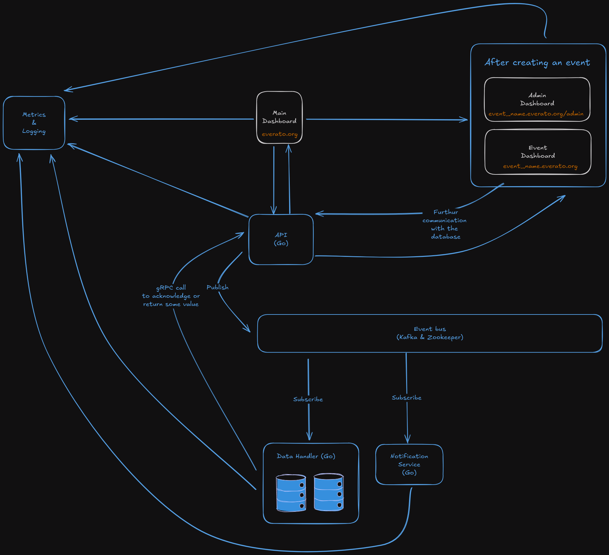

# Everato - Modern Event Management Platform

**Everato** is a comprehensive event management platform designed as a monolithic, server-side rendered application. Built with modern Go technology, Everato provides a complete solution for event creation, management, ticketing, and analytics in a single, efficient binary.

## Overview

Everato combines all functionality into a cohesive platform that handles everything from event creation to analytics, ticketing systems, payment processing, and administration through a unified, server-side rendered interface.



## Key Features

- **Single Binary Deployment**: The entire application runs from a single Go binary with an external configuration file, making deployment and scaling simple.
- **Server-Side Rendering**: Fast, SEO-friendly pages with reduced client-side JavaScript requirements.
- **Event Management**: Create, update, and manage events with customizable fields.
- **Ticketing System**: Flexible ticket types, pricing tiers, and inventory management.
- **User Management**: Comprehensive user registration, authentication, and profile management.
- **Analytics Dashboard**: Real-time insights into event performance, attendance, and revenue.
- **Payment Processing**: Secure payment handling with multiple provider options.
- **Email Notifications**: Automated confirmations, reminders, and marketing communications.
- **QR Code Generation**: Secure ticket validation through unique QR codes.

## Architecture Highlights

- **Monolithic Design**: All components are integrated into a single application, eliminating microservice complexity.
- **SSR Performance**: Server-side rendering delivers faster initial page loads and improved SEO.
- **Event Bus**: Internal event processing using Kafka for reliable asynchronous operations.
- **Database Integration**: Direct PostgreSQL connectivity with migration tooling.
- **Comprehensive Logging**: Structured logging for monitoring and debugging.

## Tech Stack

- **Backend**: Go with modern frameworks and libraries
- **Database**: PostgreSQL
- **Messaging**: Kafka & Zookeeper
- **Frontend**: Server-side rendered templates with minimal JavaScript
- **Development**: Docker for local development environment

## Getting Started

### Prerequisites

- Go 1.24+
- PostgreSQL 15+
- Docker and Docker Compose (for development environment)

### Quick Start

1. Clone the repository:

    ```
    git clone https://github.com/yourusername/everato.git
    cd everato
    ```

2. Set up environment variables:

    ```
    cp .env.example .env
    # Edit .env file with your configuration
    ```

3. Start the database:

    ```
    make db
    ```

4. Run migrations:

    ```
    make migrate-up
    ```

5. Run the application:

    ```
    # For development with hot reload
    make dev

    # For production build
    make build
    ./bin/everato
    ```

## Development

### Building

```
make build
```

### Testing

```
make test
```

### Database Management

```
# Create a new migration
make migrate-new

# Apply migrations
make migrate-up

# Roll back a migration
make migrate-down

# Seed the database with sample data
make seed
```

## Deployment

Everato can be deployed as a single binary with an accompanying configuration file:

1. Build for production:

    ```
    make build
    ```

2. Copy the binary and configuration file to your server:

    ```
    scp bin/everato config.yaml user@your-server:/path/to/deployment/
    ```

3. Run the application:
    ```
    ./everato -config config.yaml
    ```

## Contributing

Contributions are welcome! Please read our [CONTRIBUTING.md](CONTRIBUTING.md) for details on our code of conduct and the process for submitting pull requests.

## License

This project is licensed under the MIT License - see the [LICENSE](LICENSE) file for details.
